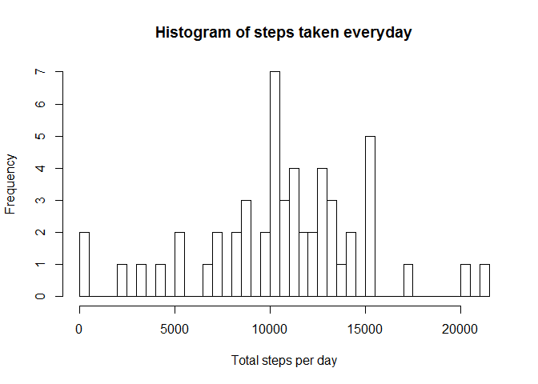
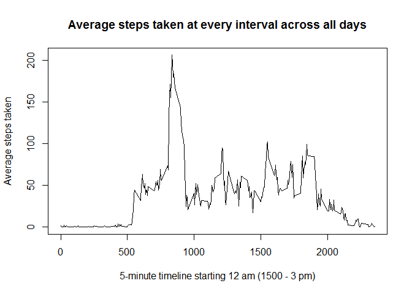
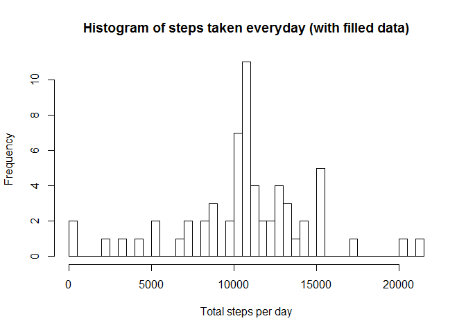
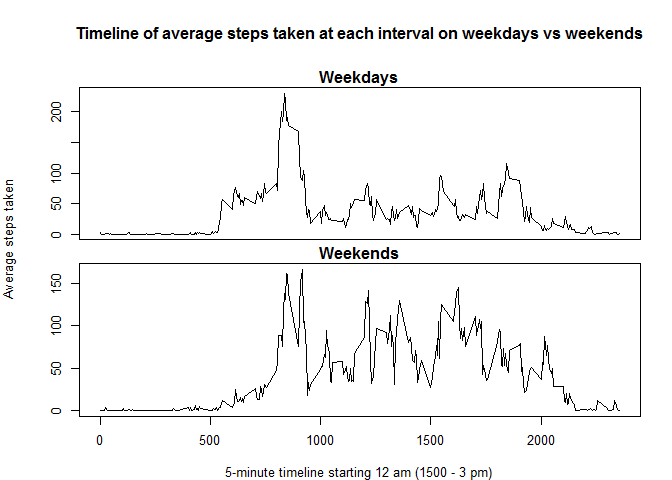

# Reproducible Research: Peer Assessment 1
Santhosh  
Friday, October 17, 2014  

---

---


## Loading and preprocessing the data

      - Read the downloaded activity.csv file into a data frame
      - Convert date column entries into objects of class "Date"


```r
    data <- read.table("./activity.csv", header=TRUE, sep=",", stringsAsFactors=FALSE)
    data$date <- as.Date(data$date, "%Y-%m-%d")
```

  
  
## What is mean total number of steps taken per day?

####Histogram of total steps taken each day

```r
    complete.data <- data[complete.cases(data), ]
    grouped.data <- aggregate(complete.data$steps, by=list(date=complete.data$date), FUN=sum)
    hist(grouped.data$x, breaks = nrow(grouped.data), main = "Histogram of steps taken everyday", xlab = "Total steps per day")
```

 


#### Calculate the mean and median total steps per day

```r
    mean.steps <- mean(grouped.data$x, na.rm=TRUE)
    median.steps <- median(grouped.data$x, na.rm=TRUE)
```
#### Print the mean total number of steps

```r
    print(mean.steps)
```

```
## [1] 10766.19
```
#### Print the median total number of steps

```r
    print(median.steps)
```

```
## [1] 10765
```


## What is the average daily activity pattern?

#### Make a time series plot of the 5-minute interval and the average number of steps taken

```r
    timed.data <- aggregate(complete.data$steps, by=list(interval=complete.data$interval), FUN=mean)
    plot(timed.data$interval, timed.data$x, type="l", main = "Average steps taken at every interval across all days", xlab="5-minute timeline starting 12 am (1500 - 3 pm)", ylab="Average steps taken")
```

 

#### Which 5-minute interval, on average across all the days in the dataset, contains the maximum number of steps?

```r
    print(timed.data$interval[which.max(timed.data$x)])
```

```
## [1] 835
```

## Imputing missing values

#### Calculate and report the total number of missing values in the dataset

```r
    print(colSums(is.na(data)))
```

```
##    steps     date interval 
##     2304        0        0
```


#### Devise a strategy for filling in all of the missing values in the dataset. 

Strategy: Fill all missing values with the mean for that 5-minute interval (extracted from timed.data dataset)

#### Create a new dataset that is equal to the original dataset but with the missing data filled in.


```r
    filled.data <- data
    na.indices <- which(is.na(filled.data$steps))
    rounded.na.indices <- ((na.indices - 1) %% 288)+1
    filled.data$steps[na.indices] <- timed.data$x[rounded.na.indices]    
```

The new dataset with filled missing data is filled.data. Here is its summary:

```r
    summary(filled.data)
```

```
##      steps             date               interval     
##  Min.   :  0.00   Min.   :2012-10-01   Min.   :   0.0  
##  1st Qu.:  0.00   1st Qu.:2012-10-16   1st Qu.: 588.8  
##  Median :  0.00   Median :2012-10-31   Median :1177.5  
##  Mean   : 37.38   Mean   :2012-10-31   Mean   :1177.5  
##  3rd Qu.: 27.00   3rd Qu.:2012-11-15   3rd Qu.:1766.2  
##  Max.   :806.00   Max.   :2012-11-30   Max.   :2355.0
```


####Histogram of total steps taken each day (after filling missing values)

```r
    complete.data <- data[complete.cases(data), ]
    grouped.filled.data <- aggregate(filled.data$steps, by=list(date=filled.data$date), FUN=sum)
    hist(grouped.filled.data$x, breaks = nrow(grouped.filled.data), main = "Histogram of steps taken everyday (with filled data)", xlab = "Total steps per day")
```

 

#### Calculate the mean and median total steps per day (after filling missing values)

```r
    mean.filled.steps <- mean(grouped.filled.data$x, na.rm=TRUE)
    median.filled.steps <- median(grouped.filled.data$x, na.rm=TRUE)
```
#### Print the mean total number of steps (after filling missing values)

```r
    print(mean.filled.steps)
```

```
## [1] 10766.19
```
#### Print the median total number of steps (after filling missing values)

```r
    print(median.filled.steps)
```

```
## [1] 10766.19
```

Mean is the same, but median is now equal to the mean. Which means data is now rounded and equally divided around the mean. Earlier median was lesser, so data was left-heavy (more data on the left of the mean). It  can be seen from the histogram that the peak is now more pronounced. This is the impact of imputing missing data.


## Are there differences in activity patterns between weekdays and weekends?

#### Create a new factor variable in the filled dataset with two levels - "weekday" and "weekend" indicating whether a given date is a weekday or weekend day.

```r
    filled.data$daytype <- weekdays(filled.data$date)
    filled.data$daytype <- sapply (filled.data$daytype, function (X) ifelse( (X == "Saturday" || X == "Sunday"), "Weekend", "Weekday" ) ) 
    filled.data$daytype <- factor(filled.data$daytype)
```


#### Make a panel plot containing a time series plot of the 5-minute interval and the average number of steps taken

```r
    weekday.data <- subset(filled.data, filled.data$daytype=="Weekday")
    weekend.data <- subset(filled.data, filled.data$daytype=="Weekend")
    timed.weekday.data <- aggregate(weekday.data$steps, by=list(interval=weekday.data$interval), FUN=mean)
    timed.weekend.data <- aggregate(weekend.data$steps, by=list(interval=weekend.data$interval), FUN=mean)
    layout(matrix(c(1,1,2,2), 2, 2, byrow=TRUE))
    par(oma=c(4,4,4,1))
    par(mar=c(0,1,1.5,1))
    plot(timed.weekday.data$interval, timed.weekday.data$x, type="l", xlab="", ylab="", main="Weekdays", xaxt='n')
    plot(timed.weekend.data$interval, timed.weekend.data$x, type="l", xlab="", ylab="", main="Weekends")
    
   title(main = "Timeline of average steps taken at each interval on weekdays vs weekends", xlab="5-minute timeline starting 12 am (1500 - 3 pm)", ylab="Average steps taken", outer=TRUE)
```

 


